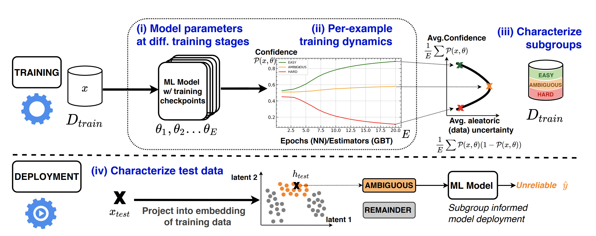
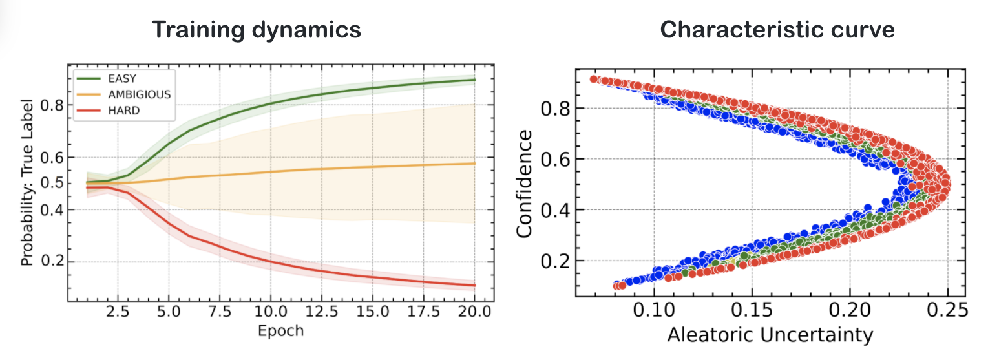

# Data-IQ: Characterizing subgroups with heterogeneous outcomes in tabular data

[](https://github.com/vanderschaarlab/Data-IQ/actions/workflows/test.yml)
[](https://github.com/vanderschaarlab/Data-IQ/actions/workflows/test_tutorials.yml)
[](https://arxiv.org/abs/2210.13043)
[](https://github.com/vanderschaarlab/Data-IQ/blob/main/LICENSE)



This repository contains the implementation of Data-IQ, a "Data-Centric AI" framework to characterize subgroups with heterogeneous outcomes in tabular data.

Data-IQ studies training dynamics and specifically studies the inherent data uncertainty (aleatoric uncertainty), to characterize data examples into the following subgroups: *EASY*, *AMBIGUOUS* and *HARD*.

Data-IQ can be used to characterize data using ***any*** machine learning model trained iteratively. We provide an interface for using Data-IQ, which can be used with **Pytorch models**, as well as, **SKLearn style API models** including *XGBoost, LightGBM and CatBoost*.

The utility of the subgroups extend to a variety of use-cases.

For more details, please read our [NeurIPS 2022 paper](Link coming soon): *Data-IQ: Characterizing subgroups with heterogeneous outcomes in tabular data*.

## Installation
1. Clone the repository
2. Create a new virtual environment with Python 3.7. e.g:
```shell
    virtualenv dataiq_env
```
3. With the venv activated, run the following command from the repository directory:

- Minimum requirements to run Data-IQ on your own data
 ```shell
pip install data_iq
 ```
or from source,
 ```shell
pip install .
 ```

- Full requirements to run Data-IQ tests and tutorials
 ```shell
pip install .[testing]
 ```

4. Link the venv to the kernel:
  ```shell
 python -m ipykernel install --user --name=dataiq_env
 ```

## Use Data-IQ in your projects with 2-lines of code to your training loops!



### Getting Data-IQ

* **Option 1**: Install as a package (called ``data_iq``) from PyPI using
 ```shell
pip install data_iq
 ```
 or from source using
 ```shell
    python -m pip install -e .
 ```

* **Option 2**: Import from the ``data_iq`` folder

Two examples using a neural network (Pytorch-style) and XGBoost (Sklearn-style) is shown below.

The lines of Data-IQ code that need to be added to your training loops are highlighted with stars in the comments. e.g. ``*** comment ***``

### 1. Data-IQ Example with Pytorch interface (NEURAL NETWORK)
```python

# Import Data-IQ
# Option 1 - if package is installed
from data_iq import DataIQ_Torch

# Option 2 - import from folder
from data_iq.dataiq_class import DataIQ_Torch

# Pytorch data loader here
train_loader = DataLoader(dataset=train_data, batch_size=128, shuffle=True)

# Define Pytorch device
device = torch.device("cuda:0" if torch.cuda.is_available() else "cpu")

# Define Pytorch model
net = Example_NN(input_size=X_train.shape[1], nlabels=len(np.unique(y_train)))
net.to(device)

# *** Initialize Data-IQ [LINE 1] ***
dataiq = DataIQ_Torch(X=X_train, y=y_train, sparse_labels=True)


# Fit Pytorch model [Training loop]
for e in range(1, EPOCHS + 1):
    net.train()

    for X_batch, y_batch in train_loader:
        ### ADD TRAIN LOOP HERE ###


    # *** CALL DATA-IQ on EPOCH END [LINE 2] ***
    dataiq.on_epoch_end(net, device=device)


# *** Access metrics ***
aleatoric_uncertainty = dataiq_xgb.aleatoric
confidence = dataiq_xgb.confidence


```

### 2. Data-IQ Example with Sklearn style interface (XGBOOST)
```python

# Import Data-IQ
# Option 1 - if package is installed
from data_iq import DataIQ_SKLearn

# Option 2 - import from folder
from data_iq.dataiq_class import DataIQ_SKLearn

# Arbitrary data loader - numpy arrays
X_train, X_test, y_train, y_test = load_data()

# *** Initialize Data-IQ [LINE 1] ***
dataiq_xgb = DataIQ_SKLearn(X=X_train, y=y_train)

# Fit XGBoost
clf = xgb.XGBClassifier(n_estimators=10)
clf.fit(X_train, y_train)

for i in range(1, nest):
    # *** Characterize with Data-IQ [LINE 2] ***
    dataiq_xgb.on_epoch_end(clf=clf, iteration=i)

# *** Access metrics ***
aleatoric_uncertainty = dataiq_xgb.aleatoric
confidence = dataiq_xgb.confidence
```

## Getting started

To get started with Data-IQ on your own data, we provide two tutorial notebooks to illustrate the usage of Data-IQ. Examples are provided both Pytorch style and SKLearn style (XGBoost, Catboost, LightGBM) models.

These notebooks can be found in the ``/tutorial`` folder. The Adult open-source dataset is given as an example dataset in the tutorials for ease of accessbility.

1. ``tutorial_torch_api.ipynb``

 - Example integration of Data-IQ with Pytorch models

2. ``tutorial_sklearn_api.ipynb``

- Example integration of Data-IQ with SKLearn style models trained iteratively (e.g. XGBoost, LigthGBM, CatBoost)


## Data-IQ metrics
The Data-IQ package provides a wide variety of metrics to characterize training dynamics.

The primary & suggested metrics are: **Aleatoric uncertainty** and **Predictive confidence**. However, other metrics are also included as part of the package.

The different metrics available to characterize training dynamics are as follows and can be accessed through the *dataiq* object:

- Aleatoric uncertainty via: `dataiq.aleatoric`
- Predictive confidence via: `dataiq.confidence`
- Variability via: `dataiq.variability`
- Entropy via: `dataiq.entropy`
- Mutual information via: `dataiq.mi`
- Correctness over training via: `dataiq.correctness`


## Use-cases

We highlight different use-cases of Data-IQ from understanding learning dynamics, creating characteristic curves, feature acquisition etc as well as, different data modalities in notebooks which can be found in the ``/use_cases`` folder.


## Citing

If you use this code, please cite the associated paper:

```
@inproceedings
{seedat2022dataiq,
title={Data-IQ: Characterizing subgroups with heterogeneous outcomes in tabular data},
author={Seedat, Nabeel and Crabbe, Jonathan and Bica, Ioana and van der Schaar, Mihaela},
booktitle={Advances in Neural Information Processing Systems},
year={2022}
}
```
